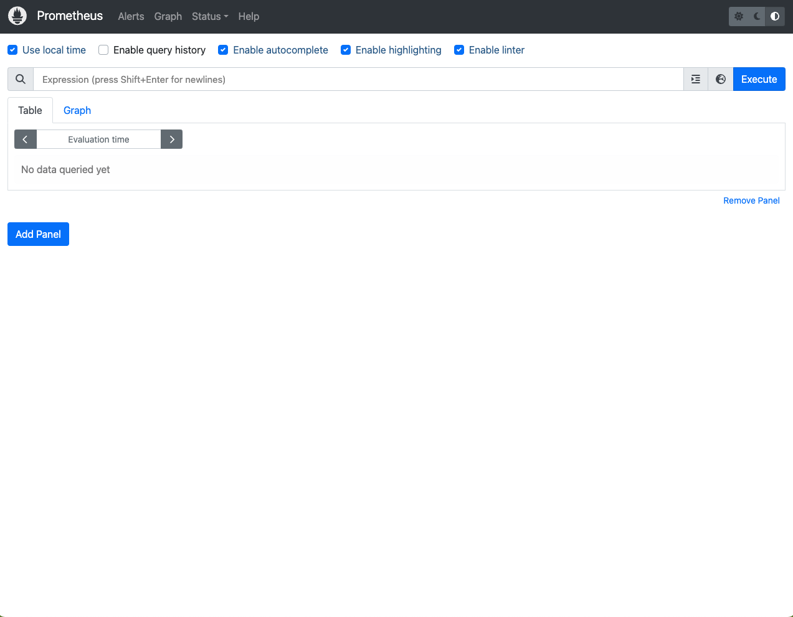
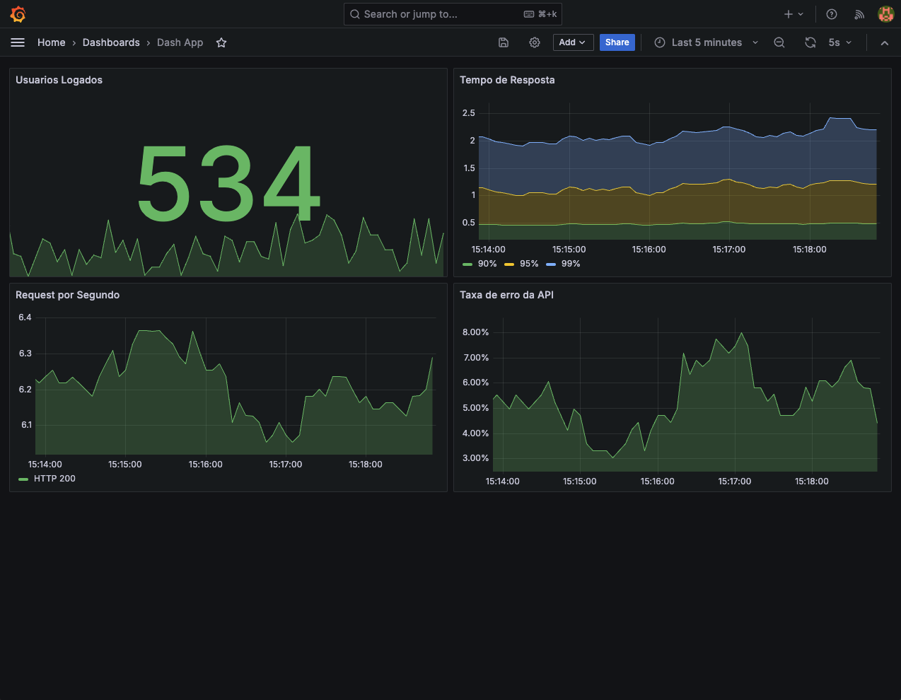

# prometheus-grafana


### Grafana

Acesse o endereço `http://localhost:3000` no navegador para acessar o *Grafana*


### Prometheus

Acesse o endereço `http://localhost:9090` no navegador para acessar o *Prometheus*



### Dashboard

Exemplo de Dashboard criado




```
$ docker compose up -d
[+] Running 6/6
 ✔ Network prometheus-grafana_default      Created                                                      0.1s 
 ✔ Volume "prometheus-grafana_grafana"     Created                                                      0.0s 
 ✔ Volume "prometheus-grafana_prometheus"  Created                                                      0.0s 
 ✔ Container prometheus                    Started                                                      2.2s 
 ✔ Container grafana                       Started                                                      2.8s 
 ✔ Container node-app                      Started                                                      3.5s 
```
```
$ docker ps
NAME         IMAGE             COMMAND                  SERVICE      CREATED         STATUS         PORTS
grafana      grafana/grafana   "/run.sh"                grafana      2 minutes ago   Up 2 minutes   0.0.0.0:3000->3000/tcp
node-app     node-app          "docker-entrypoint.s…"   node-app     2 minutes ago   Up 2 minutes   0.0.0.0:3030->3030/tcp
prometheus   prom/prometheus   "/bin/prometheus --c…"   prometheus   2 minutes ago   Up 2 minutes   0.0.0.0:9090->9090/tcp
```

Para parar e remover os container . Use `-v` para remover os volumes e apagar os dados
```
$ docker compose down -v
```